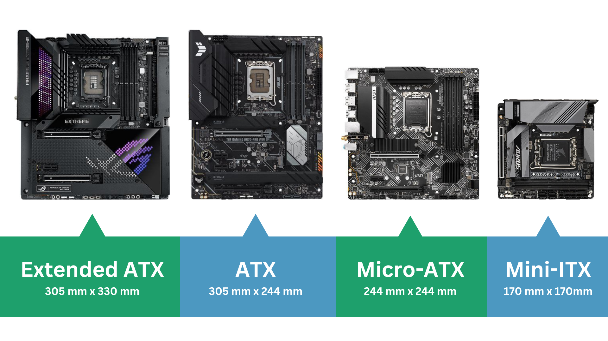

# PC Buying Guides

## CPU
[Single-Threaded Performance Overview](https://cdn.mos.cms.futurecdn.net/XUq9Uh9x2UTT97fTGZMbci.png) from [Tom's Hardware](https://www.tomshardware.com/reviews/cpu-hierarchy,4312.html)
### Intel - old Naming
- [List of Intel processors](https://en.wikipedia.org/wiki/List_of_Intel_processors)
- [Intel Naming Guide](https://www.intel.com/content/www/us/en/processors/processor-numbers.html)
- Produktlinien 
  - Core -> Konsumer, Xeon -> Workstation
- Familien i3/i5/i7/i9
- Generation 7000/8000/...14000 (2024)
- Modelnummer 100/300/310...900
- Suffixe Desktop
  - K - Overclockable
  - F - no Graphics
  - S - Special
  - T - Power-optimized lifestyle
- Suffixe Mobile
  - H - Mobile High Perform
  - P - Mobile Mediun
  - U - Mobile Power Efficient

### AMD
- [List of AMD processors](https://en.wikipedia.org/wiki/List_of_AMD_Ryzen_processors)
- [AMD Naming Guide by MSI](https://www.msi.com/blog/understand-how-amd-name-their-mobile-cpu)
- Produktlinien
  - Threadripper, Ryzen, Athlon
- Familien 3/5/7/9
- Generation 1000/2000...9000 (2025)
- Segment 600...900/950
- Suffix: X - faster, X3D - gaming

## GPU
[Generational Performance Overview](https://cdn.mos.cms.futurecdn.net/3BUQTn5dZgQi7zL8Xs4WUL.png) from [Tom's Hardware](https://www.tomshardware.com/reviews/gpu-hierarchy,4388.html)
### Nvida
- Produktlinien: GTX/RTX
- Generation 1000/2000/26XX/3000/4000/5000 (2025)

  
## Mainboard/Motherboard

## USB
For Speed also see filesystems.md
### Data
- USB 1.0 - 4v2: 1.5 MBit/s - 80 Gbit/s
- 2.0 - 480 Mbit/s
- 3.0 - 5 Gbit/s
### Power
- USB 1.0 - 3.2: 5V, 0.1-3 A, 0.5-15W
- USB-PD (Power Devlivery): different voltage rails, not all supported everywhere
  - 5V+9V+15V+20+(12V), 5 A, 100 (SPR)/240W (EPR)
- PPS (Programable Power Supply): variable adjustable voltages
### Stecker
- Typ-A: rechteckig
- Typ-B: fast quadratische
- Micro-B/Mini-B: abgerundetes Trapez
- Micro-B: doppelte
- Typ-C: ovale
### Kabel
- [Resistance Video](https://www.youtube.com/watch?v=vKJWwBXRPuI&list=WL&index=5)
- Either 60W, 100W/240W (with E-marker chip)
- USB 1/2: 4 Adern, 2x Daten, 1x Ground, 1x 5V
- USB 3: 9 Adern
- USB 3.1/Typ-C: 2x 12 Adern
### Thunderbolt
- initial mac only, own connector
- Thunderbolt 3/4: 100 W, DisplayPort, USB 3.1/4, Typ-C Connector, PCI 3.0 Lane