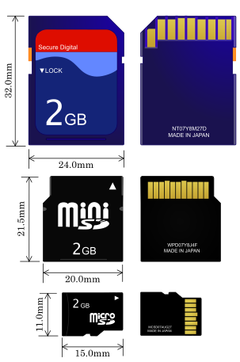
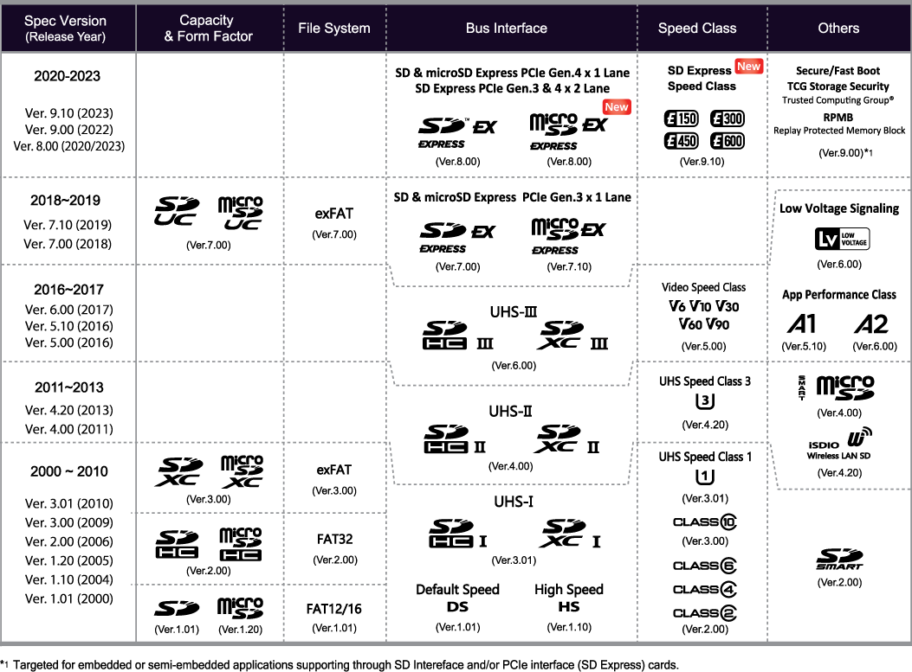

# SD-Card (Secure Digital Card)
proprietary, non-volatile, flash memory standard by non-profit SD Association (SDA, founded by multiple storage companies); developed ~2000; includes DRM

---

## Size
specifications in detail paywalled, [Simplified Specifications](https://www.sdcard.org/downloads/pls/), [PDF p.22](https://www.convict.lu/pdf/ProdManualSDCardv1.9.pdf)

### Capacity

| Name   | Capacity | File system 
| :-: | :-: | :-: 
| SD/SDSC (SD Standard Capacity)        | X < 2GB           | FAT12/16
| SDHC (High-Capacity Memory Cards)     | 2 GB <  32 GB     | FAT32
| SDXC (Extended Capacity Memory Cards) | 32 GB < 2 TB      | exFAT
| SDUC (High-Capacity Memory Cards)     | 2 TB <  128 TB    | exFAT

- Marketing in GB (Gigabyte) 10^9
    - OS shows in GiBi (Gibibyte) 2^30 ~= 1.07 * 10^9
    - usually main memory in GiBi, external storage in GB

### Speed

~30 MB/s needed for 4K Video

##### Minimum data transfer performance
- **C2/C4/C6/C10** original speed class: 2-10 MB/s, circle/C with number inside
- **U1/U3** UHS speed class: 10/30 MB/s, U with number inside
- **V6/V10/V30/V60/V90** Video speed class: 6-90 MB/s, V with number
- **E150/E300/E450/E600** Express speed class: 150-600 MB/s, E with number
- (**16x/32x/100x** CD like: relative to 1.23 Mbit/s -> 2-15 MB/s)

##### Application Performance Class
- **A1/A2**: random access for apps/OS; read/write IOPS + minimal sequential writing 

##### Bus Speed (potential connection, sequential read/write)
| Name              | Up to         | Notes 
| :-:               | :-:           | :-:
| Default           | 12.5 MB/s     |          
| High-speed        | 25 MB/s       |          
| UHS-I             | 104 MB/s      | "I" on card 
| UHS-II            | 312 MB/s      | more pins
| (UHS-III)          | 624 MB/s      | not widely used
| SD Express        | 3940 MB/s     | PCIe + NVMe + DMA

- SanDisk special mode: DDR200/225 200 MB/s read and 140 MB/s write
- Switch 2 needs SD Express

### Bus Connection
- SD - 9 pins
- microSD - 8 pins
- UHS-II - 8 additional pins (total of 17/16 pins)
- SD Express - second/third row of pins (17-19 or 25-27)

##### Bus Modes
- SPI (only 3.3V, since SDHC other modes with 1.8V)
- One-bit SD - 1x data + 1x command channel, proprietary transfer format; based on MMC-Protokol; 48-bit commands
- Four-bit SD - 4x data + 1x command channel, supported by all cards
- Two differential lines SD UHS-II - low voltage differential signaling
- SD Express - PCIe

### Misc
- SDIO (Secure Digital Input Output): extension that includes other devices e.g GPS, WiFi, Cameras; used for embedded systems

---

### Benchmark
- `sudo dd if=/dev/mmcblk0 of=sd-card-copy.img bs=1M status=progress` 86 MB/s continuous (does a full backup of the card)
- Gnome disks: 85 MB/s read, 49 MB/s write, 0.30 ms average access time
- todo: [Diagnostics](https://askubuntu.com/questions/69932/is-there-an-sd-card-diagnostic-utility)